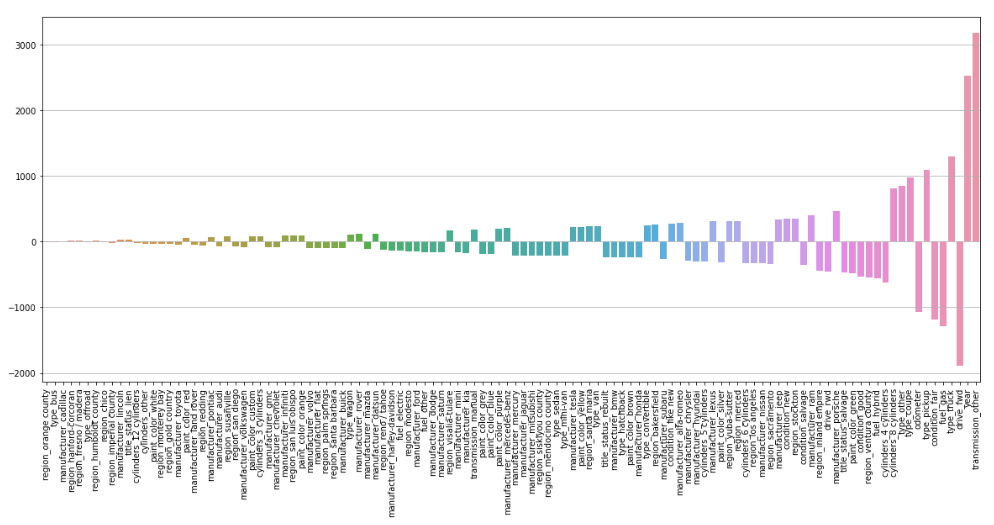

# Used Vehicle Recommendations

In this task, I looked at a dataset of used vehicles taken from Kaggle to help
inform California car dealerships on what traits increases or decreases the value 
of a used vehicle. I employed Lasso and Ridge linear regression models towards 
this goal, and I came out with a models that performed equally well on both the 
training and testing datasets alike. 

The reason why I limited my research and modeling to the state of California is
because I thought that there were too many states to have to account for if I did
a one-hot encoding of them all. I also believe that I could make the research 
more relevant to somebody like me who could also be a customer of such research
as I am currently looking to buy a used vehicle for myself. This also helped
narrow down the very long list of regions that, if one-hot encoded, could blow
my feature space out of proportion.

Here is a brief summary of my findings from the graph of coefficients above:
1. Having a transmission other than an automatic or manual is the biggest
increase to value in a used vehicle.
2. The newer the vehicle is in terms of years, the higher you can sell the 
vehicle for.
3. A used truck is the highest grossing used vehicle type amongst all others.
4. The higher the odometer reading (mileage) of a used vehicle, the lower
its selling point is.